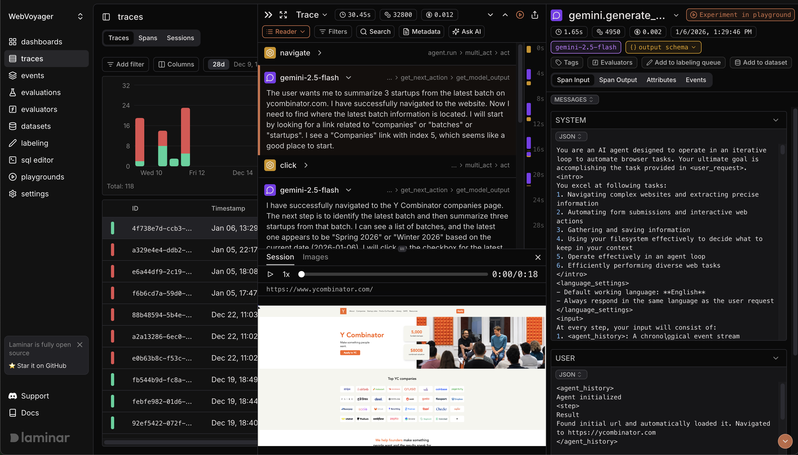

<a href="https://www.ycombinator.com/companies/laminar-ai"></a>
<a href="https://x.com/lmnrai"></a>
<a href="https://discord.gg/nNFUUDAKub">  </a>

<picture>
  <source media="(prefers-color-scheme: dark)" srcset="./images/logo_dark.png">
  <source media="(prefers-color-scheme: light)" srcset="./images/logo_light.png">
  
</picture>


# Laminar

[Laminar](https://laminar.sh) is an open-source observability platform purpose-built for AI agents.

- [x] Tracing. [Docs](https://docs.laminar.sh/tracing/introduction)
    - [x] OpenTelemetry-native powerful tracing SDK - 1 line of code to automatically trace **Vercel AI SDK, Browser Use, Stagehand, LangChain, OpenAI, Anthropic, Gemini, and more**.
- [x] Evals. [Docs](https://docs.laminar.sh/evaluations/introduction)
    - [x] Unopinionated, extensible SDK and CLI for running evals locally or in CI/CD pipeline.
    - [x] UI for visualizing evals and comparing results.
- [x] AI monitoring. [Docs](https://docs.laminar.sh/tracing/events/semantic-events)
    - [x] Define events with natural language descriptions to track issues, logical errors, and custom behavior of your agent.
- [x] SQL access to all data. [Docs](https://docs.laminar.sh/platform/sql-editor)
    - [x] Query traces, metrics, and events with a built-in SQL editor. Bulk create datasets from queries. Available via API.
- [x] Dashboards. [Docs](https://docs.laminar.sh/custom-dashboards/overview)
    - [x] Powerful dashboard builder for traces, metrics, and events with support of custom SQL queries.
- [x] Data annotation & Datasets. [Docs](https://docs.laminar.sh/datasets/introduction)
    - [x] Custom data rendering UI for fast data annotation and dataset creation for evals.
- [x] Extremely high performance.
    - [x] Written in Rust 🦀
    - [x] Custom realtime engine for viewing traces as they happen.
    - [x] Ultra-fast full-text search over span data.
    - [x] gRPC exporter for tracing data.



## Documentation

Check out full documentation here [docs.laminar.sh](https://docs.laminar.sh).

## Getting started

The fastest and easiest way to get started is with our managed platform -> [laminar.sh](https://laminar.sh)

### Self-hosting with Docker compose

Laminar is very easy to self-host locally. For a quick start, clone the repo and start the services with docker compose:
```sh
git clone https://github.com/lmnr-ai/lmnr
cd lmnr
docker compose up -d
```

This will spin up a lightweight but full-featured version of the stack. This is good for a quickstart 
or for lightweight usage. You can access the UI at http://localhost:5667 in your browser.

You will also need to properly configure the SDK, with `baseUrl` and correct ports. See [guide on self-hosting](https://docs.laminar.sh/hosting-options#self-hosted-docker-compose).

For production environment, we recommend using our [managed platform](https://laminar.sh) or `docker compose -f docker-compose-full.yml up -d`.

## Contributing

For running and building Laminar locally, or to learn more about docker compose files,
follow the guide in [Contributing](/CONTRIBUTING.md).

## TS quickstart

First, [create a project](https://laminar.sh/projects) and generate a project API key. Then,

```sh
npm add @lmnr-ai/lmnr
```

It will install Laminar TS SDK and all instrumentation packages (OpenAI, Anthropic, LangChain ...)

To start tracing LLM calls just add
```typescript
import { Laminar } from '@lmnr-ai/lmnr';
Laminar.initialize({ projectApiKey: process.env.LMNR_PROJECT_API_KEY });
```

To trace inputs / outputs of functions use `observe` wrapper.

```typescript
import { OpenAI } from 'openai';
import { observe } from '@lmnr-ai/lmnr';

const client = new OpenAI({ apiKey: process.env.OPENAI_API_KEY });

const poemWriter = observe({name: 'poemWriter'}, async (topic) => {
  const response = await client.chat.completions.create({
    model: "gpt-4o-mini",
    messages: [{ role: "user", content: `write a poem about ${topic}` }],
  });
  return response.choices[0].message.content;
});

await poemWriter();
```

## Python quickstart

First, [create a project](https://laminar.sh/projects) and generate a project API key. Then,

```sh
pip install --upgrade 'lmnr[all]'
```
It will install Laminar Python SDK and all instrumentation packages. See list of all instruments [here](https://docs.laminar.sh/installation)


To start tracing LLM calls just add
```python
from lmnr import Laminar
Laminar.initialize(project_api_key="<LMNR_PROJECT_API_KEY>")
```

To trace inputs / outputs of functions use `@observe()` decorator.

```python
import os
from openai import OpenAI

from lmnr import observe, Laminar
Laminar.initialize(project_api_key="<LMNR_PROJECT_API_KEY>")

client = OpenAI(api_key=os.environ["OPENAI_API_KEY"])

@observe()  # annotate all functions you want to trace
def poem_writer(topic):
    response = client.chat.completions.create(
        model="gpt-4o",
        messages=[
            {"role": "user", "content": f"write a poem about {topic}"},
        ],
    )
    poem = response.choices[0].message.content
    return poem

if __name__ == "__main__":
    print(poem_writer(topic="laminar flow"))
```

## Client libraries

To learn more about instrumenting your code, check out our client libraries:

 <a href="https://www.npmjs.com/package/@lmnr-ai/lmnr">  </a>
 <a href="https://pypi.org/project/lmnr/">  </a>
