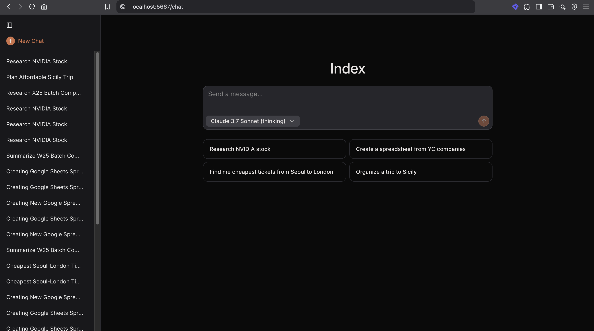

<a href="https://www.ycombinator.com/companies/laminar-ai"></a>
<a href="https://x.com/lmnrai"></a>
<a href="https://discord.gg/nNFUUDAKub">  </a>

<picture>
  <source media="(prefers-color-scheme: dark)" srcset="./images/logo_dark.png">
  <source media="(prefers-color-scheme: light)" srcset="./images/logo_light.png">
  
</picture>


# Laminar

[Laminar](https://www.lmnr.ai) is the open-source platform for tracing and evaluating AI applications.

- [x] Tracing
    - [x] OpenTelemetry-based automatic tracing of common AI frameworks and SDKs (LangChain, OpenAI, Anthropic ...) with just 2 lines of code. (powered by [OpenLLMetry](https://github.com/traceloop/openllmetry)).
    - [x] Trace input/output, latency, cost, token count.
    - [x] Function tracing with `observe` decorator/wrapper.
    - [x] Image tracing.
- [x] Evals
    - [x] Run evals in parallel with a simple SDK
- [x] Datasets
    - [x] Export production trace data to datasets.
    - [x] Run evals on hosted datasets.
- [x] Built for scale
    - [x] Written in Rust 🦀
    - [x] Traces are sent via gRPC, ensuring the best performance and lowest overhead.
- [x] Modern Open-Source stack
    - [x] RabbitMQ for message queue, Postgres for data, Clickhouse for analytics.
- [x] Dashboards for statistics / traces / evaluations / labels.


## Documentation

Check out full documentation here [docs.lmnr.ai](https://docs.lmnr.ai).

## Getting started

The fastest and easiest way to get started is with our managed platform -> [lmnr.ai](https://www.lmnr.ai)

### Self-hosting with Docker compose

For a quick start, clone the repo and start the services with docker compose:
```sh
git clone https://github.com/lmnr-ai/lmnr
cd lmnr
docker compose up -d
```

This will spin up a lightweight version of the stack with Postgres, clickhouse, app-server, and frontend. This is good for a quickstart 
or for lightweight usage. You can access the UI at http://localhost:5667 in your browser.

You will also need to properly configure the SDK, with `baseUrl` and correct ports. See https://docs.lmnr.ai/self-hosting/setup

For production environment, we recommend using our [managed platform](https://www.lmnr.ai/projects) or `docker compose -f docker-compose-full.yml up -d`.

`docker-compose-full.yml` is heavy but it will enable all the features.

- app-server – core Rust backend
- rabbitmq – message queue for reliable trace processing
- frontend – Next.js frontend and backend
- postgres – Postgres database for all the application data
- clickhouse – columnar OLAP database for more efficient trace and label analytics

## Index - SOTA browser agent



Index is a state-of-the-art open-source browser agent. It can autonomously perform complex tasks on the web.

You can use Index:
- As an [open-source package](https://github.com/lmnr-ai/index)
- As a cloud API at lmnr.ai. Read the [API reference](https://docs.lmnr.ai/api-reference/agent/agent_run) to get started.
- It powers the Chat UI behind [lmnr.ai/chat](https://lmnr.ai/chat)
    - Chat UI is also self-hostable. Read the self-hosting guide below and access the UI at `<YOUR-SELF-HOST-URL>:5667/chat`

### Spinning up Index UI locally

Currently local version of Laminar Index connects to browsers hosted on Scrapybara, and its reasoning is powered by Anthropic's Claude models. You will need API keys for both of these services.

1. Get an [Anthropic API key](https://console.anthropic.com/settings/keys)
1. Get a [Scrapybara API key](https://scrapybara.com/dashboard)
1. Update both `ANTHROPIC_API_KEY` and `SCRAPYBARA_API_KEY` values in `.env` in the root of `lmnr`
1. Laminar index agent manager will spin up as part of the default `docker-compose up`.

## Contributing

For running and building Laminar locally, or to learn more about docker compose files,
follow the guide in [Contributing](/CONTRIBUTING.md).

## TS quickstart

First, [create a project](https://www.lmnr.ai/projects) and generate a project API key. Then,

```sh
npm add @lmnr-ai/lmnr
```

It will install Laminar TS SDK and all instrumentation packages (OpenAI, Anthropic, LangChain ...)

To start tracing LLM calls just add
```typescript
import { Laminar } from '@lmnr-ai/lmnr';
Laminar.initialize({ projectApiKey: process.env.LMNR_PROJECT_API_KEY });
```

To trace inputs / outputs of functions use `observe` wrapper.

```typescript
import { OpenAI } from 'openai';
import { observe } from '@lmnr-ai/lmnr';

const client = new OpenAI({ apiKey: process.env.OPENAI_API_KEY });

const poemWriter = observe({name: 'poemWriter'}, async (topic) => {
  const response = await client.chat.completions.create({
    model: "gpt-4o-mini",
    messages: [{ role: "user", content: `write a poem about ${topic}` }],
  });
  return response.choices[0].message.content;
});

await poemWriter();
```

## Python quickstart

First, [create a project](https://www.lmnr.ai/projects) and generate a project API key. Then,

```sh
pip install --upgrade 'lmnr[all]'
```
It will install Laminar Python SDK and all instrumentation packages. See list of all instruments [here](https://docs.lmnr.ai/installation)


To start tracing LLM calls just add
```python
from lmnr import Laminar
Laminar.initialize(project_api_key="<LMNR_PROJECT_API_KEY>")
```

To trace inputs / outputs of functions use `@observe()` decorator.

```python
import os
from openai import OpenAI

from lmnr import observe, Laminar
Laminar.initialize(project_api_key="<LMNR_PROJECT_API_KEY>")

client = OpenAI(api_key=os.environ["OPENAI_API_KEY"])

@observe()  # annotate all functions you want to trace
def poem_writer(topic):
    response = client.chat.completions.create(
        model="gpt-4o",
        messages=[
            {"role": "user", "content": f"write a poem about {topic}"},
        ],
    )
    poem = response.choices[0].message.content
    return poem

if __name__ == "__main__":
    print(poem_writer(topic="laminar flow"))
```

Running the code above will result in the following trace.


## Client libraries

To learn more about instrumenting your code, check out our client libraries:

 <a href="https://www.npmjs.com/package/@lmnr-ai/lmnr">  </a>
 <a href="https://pypi.org/project/lmnr/">  </a>
