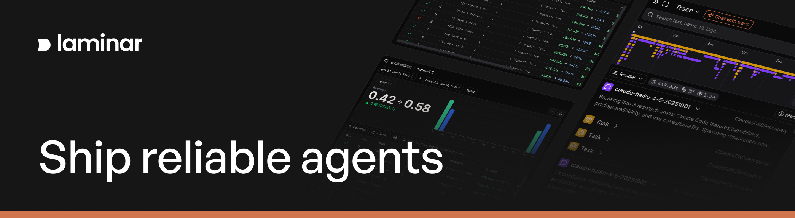
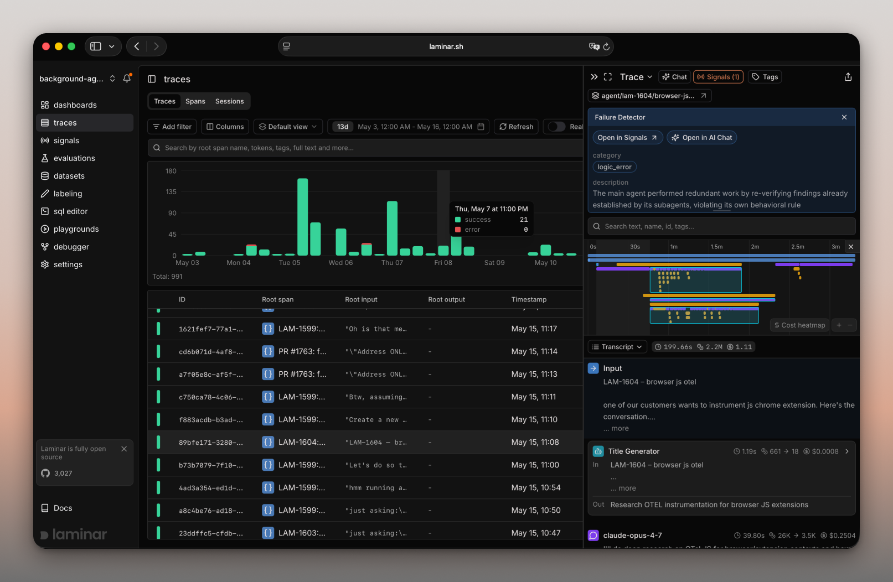

<a href="https://www.ycombinator.com/companies/laminar-ai"></a>
<a href="https://x.com/lmnrai"></a>
<a href="https://discord.gg/nNFUUDAKub"></a>



# Laminar

[Laminar](https://laminar.sh) is an open-source observability platform built for AI agents.

- **Tracing** ([docs](https://docs.laminar.sh/tracing/introduction)) – OpenTelemetry-native SDK that auto-traces Vercel AI SDK, Browser Use, Stagehand, LangChain, OpenAI, Anthropic, Gemini, and more with one line of code.
- **Evals** ([docs](https://docs.laminar.sh/evaluations/introduction)) – Extensible SDK and CLI for running evaluations locally or in CI/CD. Includes a UI for visualizing and comparing results.
- **AI monitoring** ([docs](https://docs.laminar.sh/signals)) – Define events with natural language descriptions to track issues, logical errors, and custom agent behavior.
- **SQL access** ([docs](https://docs.laminar.sh/platform/sql-editor)) – Query traces, metrics, and events with a built-in SQL editor. Bulk-create datasets from queries. Available via API.
- **Dashboards** ([docs](https://docs.laminar.sh/custom-dashboards/overview)) – Dashboard builder for traces, metrics, and events with support for custom SQL queries.
- **Data annotation & Datasets** ([docs](https://docs.laminar.sh/datasets/introduction)) – Custom data rendering UI for fast annotation and dataset creation for evals.
- **High performance** – Written in Rust. Custom realtime engine for live traces, fast full-text search, and gRPC exporter.



## Documentation

Full documentation is available at [docs.laminar.sh](https://docs.laminar.sh).

## Getting started

The fastest way to get started is with the managed platform at [laminar.sh](https://laminar.sh).

### Self-hosting with Docker Compose

Clone the repo and start the services:

```sh
git clone https://github.com/lmnr-ai/lmnr
cd lmnr
docker compose up -d
```

This spins up a lightweight version of the full stack. Access the UI at http://localhost:5667.

You will need to configure the SDK with `baseUrl` and the correct ports. See the [self-hosting guide](https://docs.laminar.sh/hosting-options#self-hosted-docker-compose).

For production, we recommend the [managed platform](https://laminar.sh) or `docker compose -f docker-compose-full.yml up -d`.

### Enabling Signals

To enable [Signals / AI monitoring](https://docs.laminar.sh/signals) in self-hosted mode, set `GOOGLE_GENERATIVE_AI_API_KEY` in your `.env` file:

```sh
GOOGLE_GENERATIVE_AI_API_KEY=your_key_here
```

## Quickstart

### TypeScript

```sh
npm add @lmnr-ai/lmnr
```

Initialize Laminar to start tracing LLM calls:

```typescript
import { Laminar } from '@lmnr-ai/lmnr';
Laminar.initialize({ projectApiKey: process.env.LMNR_PROJECT_API_KEY });
```

Use the `observe` wrapper to trace function inputs and outputs:

```typescript
import { OpenAI } from 'openai';
import { observe } from '@lmnr-ai/lmnr';

const client = new OpenAI({ apiKey: process.env.OPENAI_API_KEY });

const poemWriter = observe({name: 'poemWriter'}, async (topic) => {
  const response = await client.chat.completions.create({
    model: "gpt-4o-mini",
    messages: [{ role: "user", content: `write a poem about ${topic}` }],
  });
  return response.choices[0].message.content;
});

await poemWriter("laminar flow");
```

### Python

```sh
pip install --upgrade 'lmnr[all]'
```

Initialize Laminar to start tracing LLM calls:

```python
from lmnr import Laminar
Laminar.initialize(project_api_key="<LMNR_PROJECT_API_KEY>")
```

Use the `@observe()` decorator to trace function inputs and outputs:

```python
import os
from openai import OpenAI

from lmnr import observe, Laminar
Laminar.initialize(project_api_key="<LMNR_PROJECT_API_KEY>")

client = OpenAI(api_key=os.environ["OPENAI_API_KEY"])

@observe()  # annotate all functions you want to trace
def poem_writer(topic):
    response = client.chat.completions.create(
        model="gpt-4o",
        messages=[
            {"role": "user", "content": f"write a poem about {topic}"},
        ],
    )
    poem = response.choices[0].message.content
    return poem

if __name__ == "__main__":
    print(poem_writer(topic="laminar flow"))
```

## Client libraries

<a href="https://www.npmjs.com/package/@lmnr-ai/lmnr"></a>
<a href="https://pypi.org/project/lmnr/"></a>

## Contributing

For running and building Laminar locally, see the [Contributing guide](/CONTRIBUTING.md).
